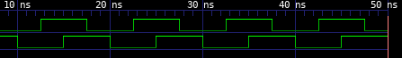

## Overview

VHDL version of "Hello, World!". Build with `make` and run with `make run`.
`make gtkwave` to visualize the waveform if it is installed.

The output should look something like this:

<p align="center">
  
</p>

## Dependencies

```
gcc
ghdl-gcc
gtkwave (For waveform visualization)
make
```
